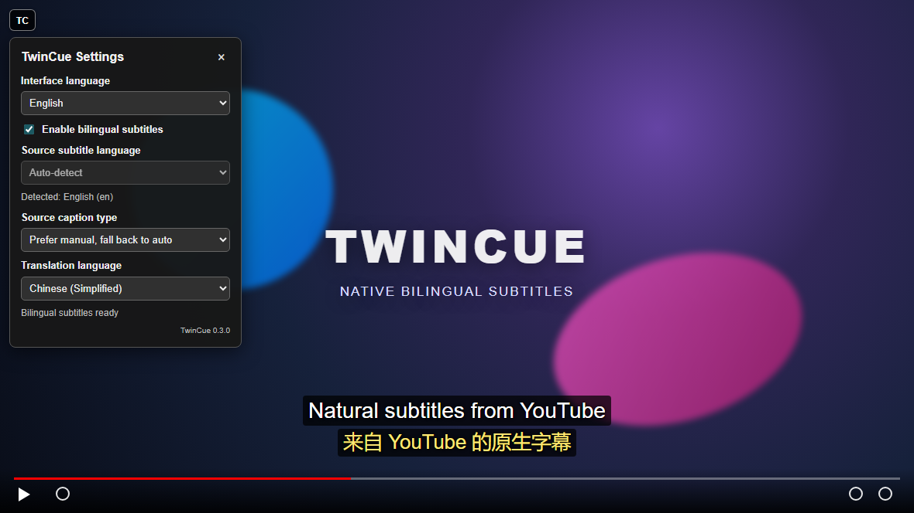

# TwinCue

[English](README.md) | [简体中文](README.zh-CN.md)

TwinCue is a single-file userscript for Tampermonkey and Violentmonkey. It displays two synchronized subtitle lines on YouTube: the video's native caption track and a YouTube auto-translated track.

No Chrome extension, Manifest, Web Store installation, or TwinCue backend is required.

> TwinCue is an independent project and is not affiliated with or endorsed by YouTube or Google.

## Features

- Automatically detects the source language from the active YouTube audio track
- Supports creator-provided and YouTube auto-generated (ASR) captions
- Uses YouTube's own auto-translation
- Renders synchronized source and translated subtitle lines
- Lets you prefer manual captions, require manual captions, or require ASR
- Includes a 20-language translation dropdown
- Includes selectable English and Simplified Chinese interfaces
- Provides an in-player **TC** settings button
- Stores settings only in YouTube local storage
- Updates directly from GitHub through userscript-manager update checks

## Install

1. Install a userscript manager:
   - [Tampermonkey](https://www.tampermonkey.net/)
   - [Violentmonkey](https://violentmonkey.github.io/)
2. Open the [TwinCue userscript](https://raw.githubusercontent.com/bakapiano/Youtube-TwinCue/main/userscript/TwinCue.user.js).
3. Confirm installation in the userscript manager.
4. Open or refresh a YouTube video with captions.

For local development, import [`userscript/TwinCue.user.js`](userscript/TwinCue.user.js) directly into the userscript manager.

## Preview



Click **TC** in the player, choose the caption type and translation language, then continue watching with synchronized bilingual subtitles.

## Use

1. Play a YouTube video that has captions.
2. Click the **TC** button in the upper-left corner of the player.
3. Choose:
   - Source caption type: prefer manual / manual only / auto-generated only
   - Translation language
   - Interface language: English / 中文
4. TwinCue detects the source language and renders both subtitle lines.

Settings are saved under `twincue:settings:v1` in YouTube local storage.

## How it works

Modern YouTube timed-text requests require a short-lived Proof-of-Origin token (PoToken). Directly fetching `captionTracks[].baseUrl` can return HTTP 200 with an empty body.

TwinCue runs at `document-start` in the YouTube page and:

1. Reads caption metadata from `ytInitialPlayerResponse`.
2. Detects the source language from the active `audioTrackId`.
3. Asks the YouTube player to select source and translated caption tracks.
4. Captures the player's valid `/api/timedtext?...&pot=...` JSON3 responses.
5. Aligns cue timestamps and renders a bilingual overlay.

PoTokens and signed caption URLs expire and are not persisted.

## Privacy

TwinCue has no backend, analytics, advertising, or remote code. Caption text is processed inside the YouTube page and is not sent to a TwinCue service.

The only persistent data is the user's TwinCue settings in YouTube local storage.

## Development

Requirements:

- Node.js 22+
- Playwright Chromium for the simulated integration test
- Google Chrome and the ignored `.browser-profile/chrome` directory for the optional signed-in profile test

Install dependencies and browsers:

```powershell
npm install
npx playwright install chromium
```

Run syntax, metadata, and simulated YouTube integration tests:

```powershell
npm run check
npm test
npm run docs:screenshots
```

Run the optional real YouTube test with the previously signed-in development profile:

```powershell
npm run test:profile
```

The real-profile test opens regular Chrome off-screen, injects the userscript into a real YouTube watch page, verifies native and translated caption responses, and writes its ignored report to `artifacts/`.

## Project layout

```text
userscript/TwinCue.user.js          Installable userscript
test/userscript.integration.test.mjs Simulated YouTube integration test
test/userscript.metadata.test.mjs    Metadata and Chrome-API independence checks
scripts/diagnose-userscript-profile.mjs Optional signed-in profile test
```

## Limitations

- TwinCue depends on undocumented YouTube player internals that may change.
- A video must expose a translatable caption track.
- Translation quality is determined by YouTube.
- Users must install a userscript manager first.
