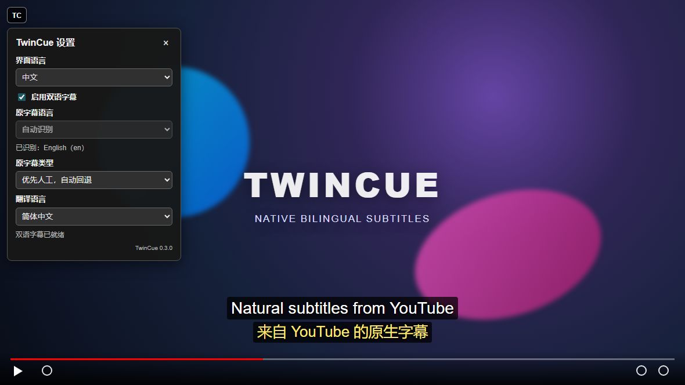

# TwinCue

[English](README.md) | [简体中文](README.zh-CN.md)

TwinCue 是一个适用于 Tampermonkey 和 Violentmonkey 的单文件用户脚本，可在 YouTube 视频上同步显示两行字幕：视频原字幕，以及由 YouTube 自动翻译生成的第二语言字幕。

不再需要 Chrome 扩展、Manifest、Chrome 商店或 TwinCue 后端服务。

> TwinCue 是独立项目，与 YouTube 或 Google 无隶属或背书关系。

## 功能

- 根据当前 YouTube 音轨自动识别原字幕语言
- 支持创作者提供的人工字幕与 YouTube 自动生成字幕（ASR）
- 使用 YouTube 自带自动翻译
- 同步显示原文和译文两行字幕
- 可选择“优先人工 / 仅人工 / 仅自动生成字幕”
- 提供包含 20 种语言的翻译下拉框
- 界面支持中文和 English 切换
- 在播放器左上角提供 **TC** 设置按钮
- 设置仅保存在 YouTube 本地存储中
- 通过用户脚本管理器直接从 GitHub 检查更新

## 安装

1. 安装用户脚本管理器：
   - [Tampermonkey](https://www.tampermonkey.net/)
   - [Violentmonkey](https://violentmonkey.github.io/)
2. 打开 [TwinCue 用户脚本](https://raw.githubusercontent.com/bakapiano/Youtube-TwinCue/main/userscript/TwinCue.user.js)。
3. 在脚本管理器中确认安装。
4. 打开或刷新一个带字幕的 YouTube 视频。

本地开发时，也可以直接把 [`userscript/TwinCue.user.js`](userscript/TwinCue.user.js) 导入脚本管理器。

## 使用预览



点击播放器中的 **TC**，选择字幕类型和翻译语言，即可继续观看同步双语字幕。

## 使用

1. 播放一个带字幕的 YouTube 视频。
2. 点击播放器左上角的 **TC** 按钮。
3. 选择：
   - 原字幕类型：优先人工 / 仅人工 / 仅自动生成
   - 翻译语言
   - 界面语言：中文 / English
4. TwinCue 会自动识别原语言并显示双语字幕。

设置保存在 YouTube 本地存储的 `twincue:settings:v1` 中。

## 工作原理

目前 YouTube 的 timed-text 字幕请求需要短时有效的 Proof-of-Origin Token（PoToken）。仅获取 `captionTracks[].baseUrl` 后直接请求，可能出现 HTTP 200 但正文为空。

TwinCue 在 YouTube 页面的 `document-start` 阶段运行：

1. 从 `ytInitialPlayerResponse` 读取字幕轨道元数据。
2. 从当前 `audioTrackId` 识别原语言。
3. 让 YouTube 播放器选择原字幕和目标翻译字幕。
4. 捕获播放器实际发出的 `/api/timedtext?...&pot=...` JSON3 响应。
5. 对齐时间轴并绘制双语字幕覆盖层。

PoToken 与签名字幕 URL 都会过期，脚本不会长期保存它们。

## 隐私

TwinCue 没有后端、统计、广告或远程代码。字幕文本只在 YouTube 页面内处理，不会发送到 TwinCue 服务。

唯一持久保存的数据是 YouTube 本地存储中的 TwinCue 设置。

## 开发

环境要求：

- Node.js 22+
- 模拟集成测试需要 Playwright Chromium
- 可选的登录 Profile 测试需要 Google Chrome 和已忽略的 `.browser-profile/chrome` 目录

安装依赖和浏览器：

```powershell
npm install
npx playwright install chromium
```

运行语法、元数据和模拟 YouTube 集成测试：

```powershell
npm run check
npm test
npm run docs:screenshots
```

使用之前登录过的开发 Profile 运行真实 YouTube 测试：

```powershell
npm run test:profile
```

真实 Profile 测试会在屏幕外启动普通 Chrome，把用户脚本注入真实 YouTube 播放页，验证原字幕和自动翻译响应，并把已忽略的报告写入 `artifacts/`。

## 目录结构

```text
userscript/TwinCue.user.js            可直接安装的用户脚本
test/userscript.integration.test.mjs  模拟 YouTube 集成测试
test/userscript.metadata.test.mjs     元数据与 Chrome API 独立性检查
scripts/diagnose-userscript-profile.mjs 可选的登录 Profile 测试
```

## 限制

- TwinCue 依赖未公开的 YouTube 播放器内部接口，未来可能变化。
- 视频必须提供可翻译的字幕轨道。
- 翻译质量由 YouTube 决定。
- 用户需要先安装一个用户脚本管理器。
